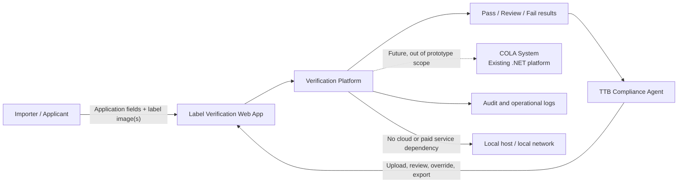
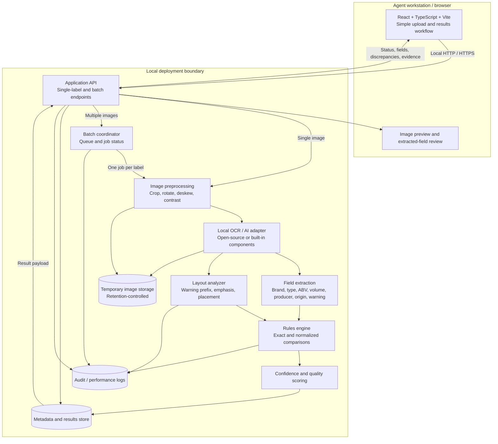
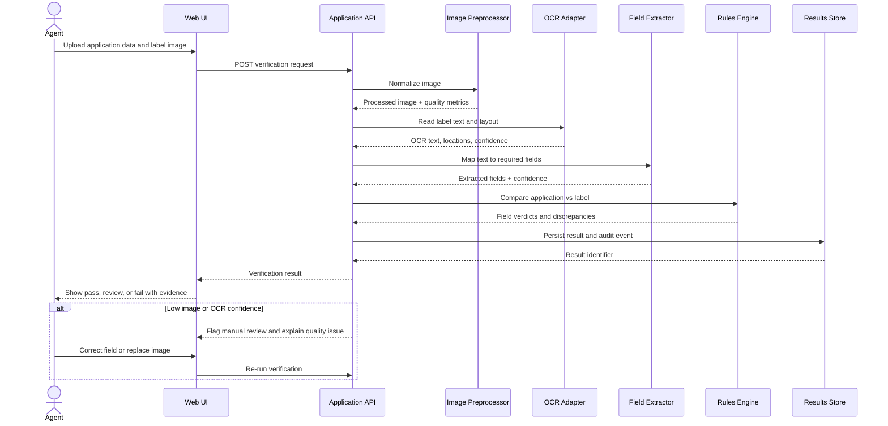
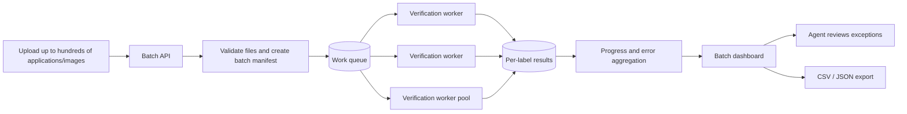
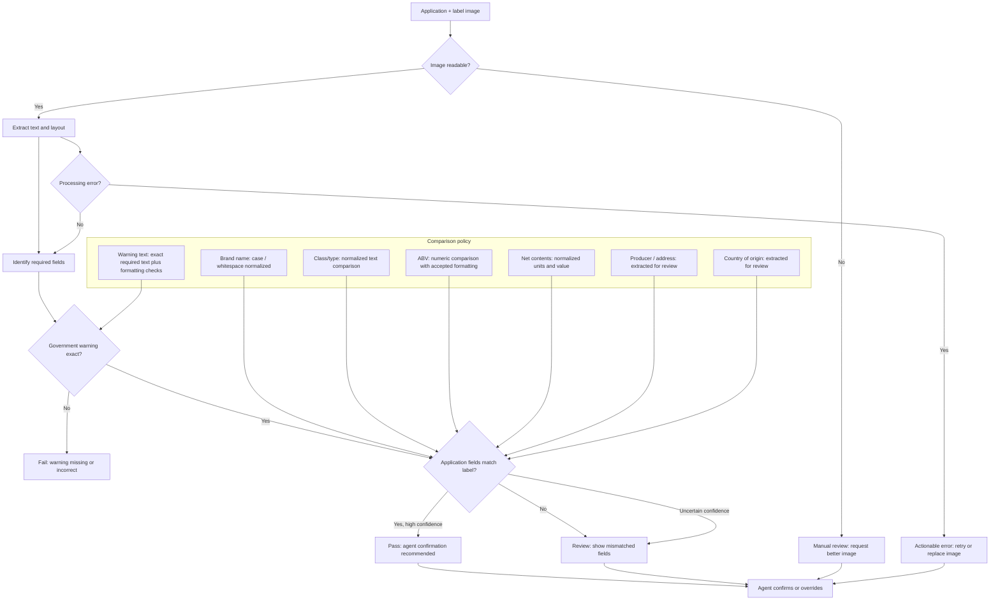
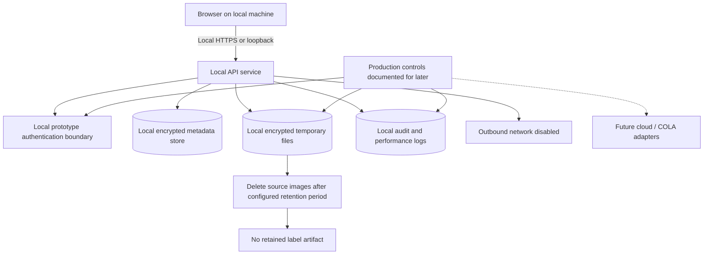
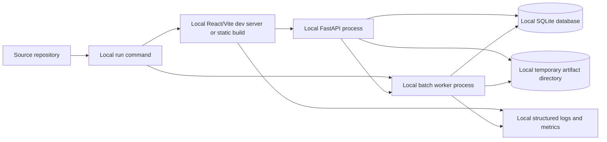

# AI-Powered Alcohol Label Verification Architecture

## System Context



## Technology Decisions

| Layer | Local prototype choice | Responsibility |
| --- | --- | --- |
| Frontend | React + TypeScript + Vite | Upload workflow, progress states, result presentation, evidence review, corrections, overrides, and batch dashboard |
| Backend API | FastAPI | Local HTTP API, request validation, orchestration, result contracts, and error handling |
| OCR and image processing | Tesseract plus OpenCV/Pillow | Local text recognition, preprocessing, quality scoring, and evidence coordinates |
| Compliance logic | Python rules engine | Field normalization, exact warning checks, comparison decisions, confidence thresholds, and review routing |
| Persistence | SQLite | Applications, extracted fields, verdicts, corrections, overrides, batch jobs, and audit events |
| Batch execution | Local worker process and filesystem-backed queue | Asynchronous batch processing, progress, isolation of item failures, and retries |

The React application is a presentation and interaction layer only. It never makes the compliance decision: all OCR, validation, persistence, batch work, and exports are performed locally by the backend. This keeps behavior testable, consistent across clients, and usable with network access disabled.

## Container Architecture



## Verification Flow



## Batch Processing Flow



## Validation Decision Model



## Request and Result Contracts

### Single-label request

```json
{
  "application": {
    "brandName": "OLD TOM DISTILLERY",
    "classType": "Kentucky Straight Bourbon Whiskey",
    "alcoholContent": "45% Alc./Vol. (90 Proof)",
    "netContents": "750 mL",
    "producer": "Example Distillery, Kentucky",
    "countryOfOrigin": "United States"
  },
  "labelImage": "multipart/form-data image",
  "options": {
    "retainArtifacts": false
  }
}
```

### Verification result

```json
{
  "verificationId": "ver_123",
  "status": "pass | review | fail",
  "processingTimeMs": 3200,
  "quality": {
    "imageReadable": true,
    "qualityIssues": [],
    "ocrConfidence": 0.97
  },
  "checks": [
    {
      "field": "brandName",
      "status": "match",
      "applicationValue": "OLD TOM DISTILLERY",
      "labelValue": "OLD TOM DISTILLERY",
      "confidence": 0.99
    },
    {
      "field": "governmentWarning",
      "status": "match",
      "confidence": 0.96,
      "exactText": true,
      "formattingDetected": true,
      "evidence": {
        "textRegion": [120, 840, 980, 940],
        "emphasisDetected": true
      }
    }
  ],
  "requiresHumanReview": false
}
```

## Runtime and Security Boundaries



- **Prototype boundary:** standalone local application; no direct COLA integration, cloud infrastructure, paid APIs, or outbound network dependency.
- **Performance target:** return a single-label result in approximately 5 seconds or less under normal conditions. Batch jobs are asynchronous and expose progress instead of blocking the agent.
- **Human-in-the-loop:** automated results are recommendations. Agents can inspect OCR evidence, correct extracted values, replace poor images, and override the result.
- **AI/OCR boundary:** the adapter uses local/open-source or already-installed components. External providers are not required for the zero-cost prototype, and processing remains functional with outbound traffic disabled.
- **Evidence-first review:** every extracted field includes confidence and source-region evidence where available. Low confidence, missing fields, processing errors, and ambiguous comparisons produce actionable retry or manual-review states instead of automatic approval.
- **Warning handling:** the warning statement is treated as an exact-content check. The rules engine separately records whether `GOVERNMENT WARNING:` is uppercase and whether the required emphasis/layout signal is detected.
- **Data minimization:** retain only application metadata, extracted fields, verdicts, and audit events by default. Source images and processed artifacts use configurable retention and deletion policies.
- **Resilience:** individual batch failures are isolated to a label-level error. The batch continues, and the dashboard identifies failed, completed, and manual-review items.
- **Future integrations:** Azure, paid AI services, and an authenticated COLA adapter may be added only after authorization, cost, data mapping, retention, and federal security requirements are approved. The local verification pipeline remains independent of them.

## Requirement Traceability

| Requirement | Architecture coverage |
| --- | --- |
| Single-label verification | Web UI, API, synchronous preprocessing/OCR/extraction/validation flow |
| Required TTB fields | Field extractor and rules engine cover brand, class/type, ABV, net contents, producer/address, origin, and warning |
| Exact warning validation | OCR text equality plus layout analyzer for uppercase prefix, emphasis, and placement signals |
| Reasonable field normalization | Rules engine applies case/whitespace, numeric, unit, and text normalization while preserving discrepancies |
| Imperfect images | Image preprocessor, quality metrics, retry/replacement path, and manual review threshold |
| Approximately 5-second response | Fast synchronous path, local-first processing, performance logs, and latency monitoring |
| 200-300 item batches | Batch manifest, queue, worker pool, isolated per-label failures, progress dashboard, and export |
| Accessible agent workflow | React UI provides clear upload, verify, review, retry, override, and batch exception actions |
| Standalone prototype | No COLA dependency; no sensitive data required; local processing only |
| Zero-cost local deployment | Local API, local worker process, embedded metadata store, and temporary local artifact directory |
| No outbound dependency | Local/open-source OCR/AI adapter and operation with network access disabled |
| Security and retention | TLS, authentication boundary, encrypted stores, audit events, retention-controlled artifacts |
| Future integrations | Azure, paid AI services, and authenticated COLA adapter reserved behind replaceable boundaries |

## Local Deployment Shape



### Local runtime assumptions

- The API, worker, OCR, rules engine, database, and temporary file storage run on one developer or reviewer machine unless a local-network host is explicitly chosen.
- SQLite or another embedded local database is sufficient for the prototype; no managed database is required.
- A filesystem-backed work queue is sufficient for local batch processing; a hosted queue is not required.
- Uploaded images are stored temporarily and deleted according to the configured retention policy.
- Test data is synthetic or non-sensitive.
- The prototype is not an official COLA submission or regulatory decision system.
