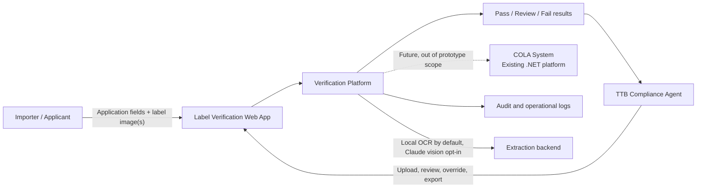
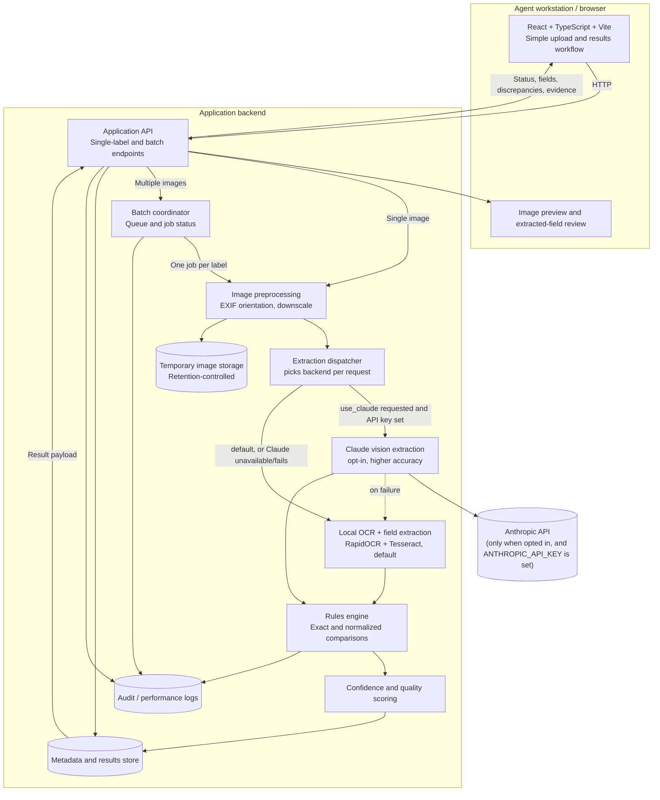
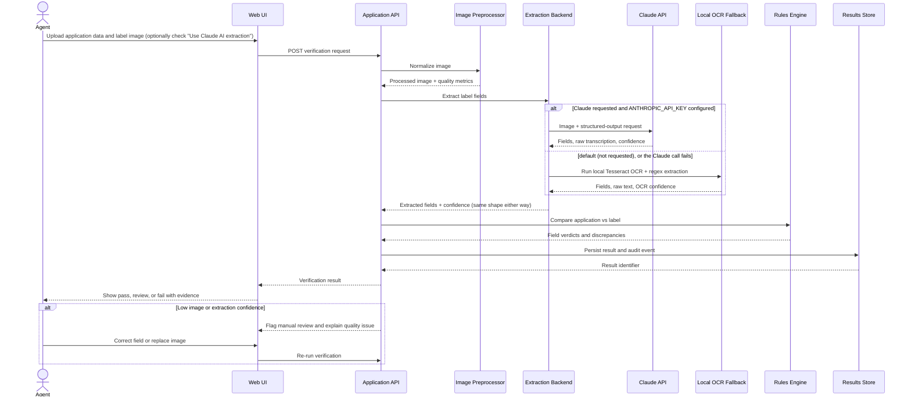
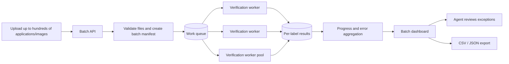
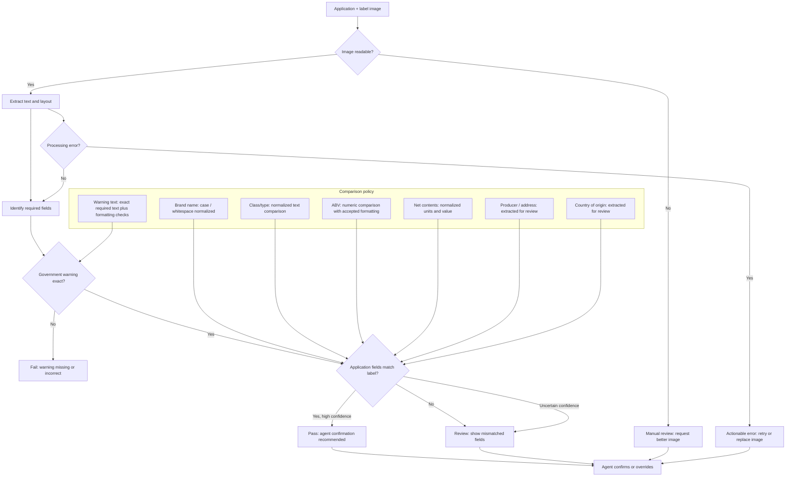
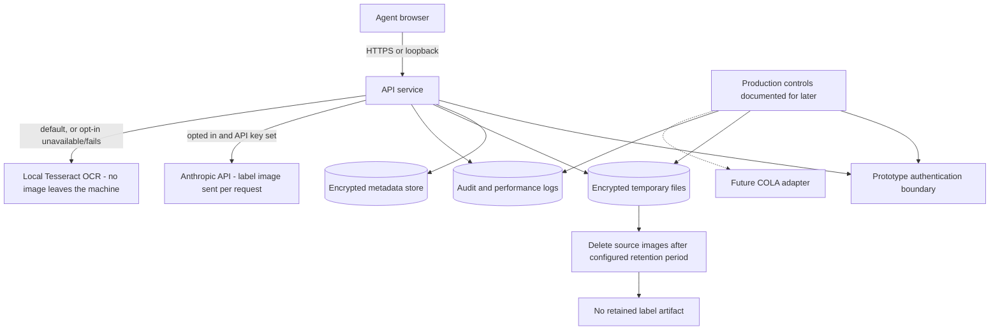
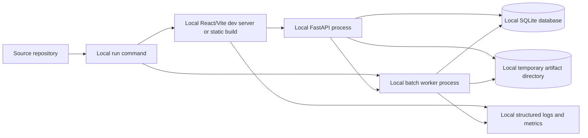

# AI-Powered Alcohol Label Verification Architecture

## System Context



## Technology Decisions

| Layer | Prototype choice | Responsibility |
| --- | --- | --- |
| Frontend | React + TypeScript + Vite | Upload workflow, progress states, result presentation, evidence review, corrections, overrides, and batch dashboard |
| Backend API | FastAPI | HTTP API, request validation, orchestration, result contracts, and error handling |
| Extraction (default) | RapidOCR (ONNXRuntime, optional extra) plus Tesseract plus Pillow | Local text recognition, preprocessing, quality scoring, and evidence coordinates - RapidOCR drives most fields (more accurate on real photos), Tesseract specifically supplies the government warning (RapidOCR glues small print together with no spaces, which breaks the exact-text check) - the fast, no-network default path used unless an agent opts in to Claude |
| Extraction (opt-in) | Claude API (vision), structured output | Reads label fields directly from the image; a semantic read, not OCR-then-regex. Requested per verification (checkbox in the UI / `use_claude=true`) for higher accuracy on hard photos, at higher latency and a per-call API cost - see "Technology Decisions" note below |
| Compliance logic | Python rules engine | Field normalization, exact warning checks, comparison decisions, confidence thresholds, and review routing |
| Persistence | SQLite | Applications, extracted fields, verdicts, corrections, overrides, batch jobs, and audit events |
| Batch execution | Local worker process and filesystem-backed queue | Asynchronous batch processing, progress, isolation of item failures, and retries |

The React application is a presentation and interaction layer only. It never makes the compliance decision: all extraction, validation, persistence, batch work, and exports are performed by the backend. This keeps behavior testable and consistent across clients. The local-default, Claude-opt-in design exists because measured latency on real label photos put Claude vision (Sonnet 5, low reasoning effort) at ~10s average and up to ~21s - well past the ~5 second target in requirements.md section 3 - while local OCR has no network round trip and reliably meets it; Claude remains available per-request for an agent who wants its higher accuracy on a hard image and is willing to trade the latency and API cost for it, and the app also remains fully functional when the Claude API is unreachable or no key is configured, since that was never the default path. The local default itself splits across two engines rather than picking one: RapidOCR reads normal print more accurately than Tesseract, but Tesseract's word-level bounding boxes avoid a space-gluing failure RapidOCR has on the small, dense print the government warning is printed in - so RapidOCR drives every field except the warning, which always comes from Tesseract.

## Container Architecture



## Verification Flow



## Batch Processing Flow



## Validation Decision Model



## Request and Result Contracts

### Single-label request

```json
{
  "application": {
    "brandName": "OLD TOM DISTILLERY",
    "classType": "Kentucky Straight Bourbon Whiskey",
    "alcoholContent": "45% Alc./Vol. (90 Proof)",
    "netContents": "750 mL",
    "producer": "Example Distillery, Kentucky",
    "countryOfOrigin": "United States"
  },
  "labelImage": "multipart/form-data image",
  "options": {
    "retainArtifacts": false
  }
}
```

### Verification result

```json
{
  "verificationId": "ver_123",
  "status": "pass | review | fail",
  "processingTimeMs": 3200,
  "quality": {
    "imageReadable": true,
    "qualityIssues": [],
    "ocrConfidence": 0.97
  },
  "checks": [
    {
      "field": "brandName",
      "status": "match",
      "applicationValue": "OLD TOM DISTILLERY",
      "labelValue": "OLD TOM DISTILLERY",
      "confidence": 0.99
    },
    {
      "field": "governmentWarning",
      "status": "match",
      "confidence": 0.96,
      "exactText": true,
      "formattingDetected": true,
      "evidence": {
        "textRegion": [120, 840, 980, 940],
        "emphasisDetected": true
      }
    }
  ],
  "requiresHumanReview": false
}
```

## Runtime and Security Boundaries



- **Prototype boundary:** standalone application; no direct COLA integration. Extraction backend is configurable per request: local OCR (RapidOCR + Tesseract) by default, Claude vision only when an agent explicitly opts in (and `ANTHROPIC_API_KEY` is set) - see README.md "Deployment".
- **Performance target:** return a single-label result in approximately 5 seconds or less under normal conditions - this is what the default local-OCR path is designed around and reliably meets. The Claude opt-in path does not meet this target (measured ~10s average, up to ~21s on real photos), which is exactly why it's an explicit per-request choice rather than automatic. Batch jobs are asynchronous and expose progress instead of blocking the agent.
- **Human-in-the-loop:** automated results are recommendations. Agents can inspect extraction evidence, correct extracted values, replace poor images, and override the result.
- **Extraction backend:** local OCR is the default path, chosen to meet the ~5 second target - RapidOCR (app/services/rapid_ocr.py, an optional extra) drives most fields for better accuracy on real photos, while Tesseract (app/services/ocr.py, app/services/extraction.py) always supplies the government warning field specifically to avoid RapidOCR's space-gluing failure mode on small print, and is also the sole engine if RapidOCR isn't installed or its read fails. Claude vision (app/services/claude_extraction.py) reads the label image directly and returns structured fields via the Anthropic API - meaningfully more accurate still on hard photos, but only run when an agent requests it (see README.md "Approach" for the measured latency tradeoff that drove this). A Claude failure or an opt-in request made without a configured key falls back to local OCR automatically.
- **Evidence-first review:** every extracted field includes confidence and the full raw transcription for evidence review. Low confidence, missing fields, processing errors, and ambiguous comparisons produce actionable retry or manual-review states instead of automatic approval.
- **Warning handling:** the warning statement is treated as an exact-content check, compared against the required statutory text after whitespace normalization. Neither extraction backend independently proves bold typography or placement - see README.md "Current Limitations".
- **Data minimization:** retain only application metadata, extracted fields, verdicts, and audit events by default. Source images and processed artifacts use configurable retention and deletion policies. Only when an agent opts into Claude extraction is the label image additionally transmitted to the Anthropic API as part of that request - see README.md "Security and Data Handling".
- **Resilience:** individual batch failures are isolated to a label-level error. The batch continues, and the dashboard identifies failed, completed, and manual-review items. A Claude extraction failure (when opted in) is isolated the same way, at the per-verification level, by falling back to local OCR rather than failing that item.
- **Future integrations:** an authenticated COLA adapter may be added only after authorization, cost, data mapping, retention, and federal security requirements are approved. The verification pipeline remains independent of it.

## Requirement Traceability

| Requirement | Architecture coverage |
| --- | --- |
| Single-label verification | Web UI, API, synchronous preprocessing/extraction/validation flow |
| Required TTB fields | Extraction backend (local OCR by default, or Claude vision when opted in) and rules engine cover brand, class/type, ABV, net contents, producer/address, origin, and warning |
| Exact warning validation | Verbatim transcription (from either extraction backend) compared against the required statutory text for exact-text equality |
| Reasonable field normalization | Rules engine applies case/whitespace, numeric, unit, and text normalization while preserving discrepancies |
| Imperfect images | Image preprocessor, quality metrics, retry/replacement path, and manual review threshold |
| Approximately 5-second response | Local OCR default path (meets the target; Claude opt-in trades it for accuracy - see "Technology Decisions"), performance logs, and latency monitoring |
| 200-300 item batches | Batch manifest, queue, worker pool, isolated per-label failures, progress dashboard, and export |
| Accessible agent workflow | React UI provides clear upload, verify, review, retry, override, and batch exception actions |
| Standalone prototype | No COLA dependency; no sensitive data required |
| Resilient extraction | Local OCR (RapidOCR + Tesseract) as the default extraction backend, with Tesseract-only as the automatic fallback if RapidOCR is unavailable; Claude vision available as an opt-in upgrade, with automatic fallback to local OCR if requested without a key configured or if a call fails |
| Security and retention | TLS, authentication boundary, encrypted stores, audit events, retention-controlled artifacts |
| Future integrations | Authenticated COLA adapter reserved behind a replaceable boundary |

## Local Deployment Shape



### Local runtime assumptions

- The API, worker, rules engine, database, and temporary file storage run on one developer or reviewer machine (or container) regardless of extraction backend; the default local OCR path (RapidOCR + Tesseract) makes no outbound calls, while the opt-in Claude extraction path makes one outbound call to the Anthropic API per verification when an agent requests it and a key is configured.
- SQLite or another embedded local database is sufficient for the prototype; no managed database is required.
- A filesystem-backed work queue is sufficient for local batch processing; a hosted queue is not required.
- Uploaded images are stored temporarily and deleted according to the configured retention policy.
- Test data is synthetic or non-sensitive.
- The prototype is not an official COLA submission or regulatory decision system.
